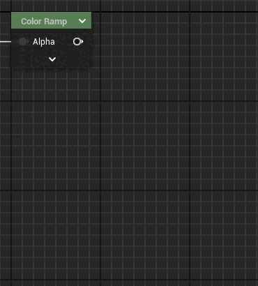
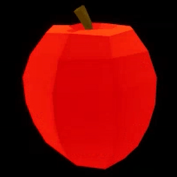

# Color Ramp

Color Ramp is a powerful Unreal Engine 5 custom material expression that allows you to create smooth transitions between multiple color points based on defined positions, using various interpolation methods. Additionally, this node provides flexible pin configuration options, including distributed position management for automatic spacing of points.

## Color Interpolation

The `Color Ramp` node enables you to define multiple color points and smoothly transition between them using interpolation. It supports several interpolation methods:

- **Constant**: No blending; a sharp transition from one color to another.
- **Linear**: Simple linear interpolation between colors.
- **Ease**: Smooth interpolation with an ease-in/ease-out effect.

You can specify the interpolation type for the entire color ramp by choosing from the available options in the `Interpolation Type` dropdown.

## Example Use Cases

### Multi-Color Transition

To create a multi-color transition with custom position values, use `ShowAllPinsAlternate`. You can then control both the colors and their positadienions in the grt, allowing for more complex patterns.

### Vertex Animation Sampling

### Height based transitions

## Pin Configuration

The `Pin Type` enum allows you to configure which pins (color and position) are exposed and how they are distributed across the ramp:

| Pin Type                          | Description                                                                                 |
| --------------------------------- | ------------------------------------------------------------------------------------------- |
| **Hide Pins**                     | All pins are hidden, and only default values for colors and positions are used.             |
| **Hide Pins (Distributed)**       | Similar to `Hide Pins`, but positions are automatically distributed evenly from 0 to 1.     |
| **Show Color Pins**               | Only color pins are exposed.                                                                |
| **Show Color Pins (Distributed)** | Color pins are exposed, and positions are automatically distributed evenly from 0 to 1.     |
| **Show Position Pins**            | Only position pins are exposed.                                                             |
| **Show All Pins (Alternate)**     | Both color and position pins are exposed alternately (e.g., `Color 1`, `Position 1`, etc.). |
| **Show All Pins (Group)**         | All color pins are exposed first, followed by all position pins.                            |

This flexible pin configuration ensures that you have full control over how color and position data are exposed and manipulated.

### Points

Each color point in the ramp has customizable default values for both color and position, ensuring that the ramp behaves predictably even when no inputs are connected.

In modes like `Hide Pins (Distributed)` and `Show Color Pins (Distributed)`, the positions of the color points are automatically distributed evenly between 0 and 1. This feature is useful for creating smooth, evenly spaced gradients without the need for manual position adjustments. In other modes, such as `Show Position Pins` or `Show All Pins`, you can manually specify the position of each color point for finer control over the gradient's shape.

